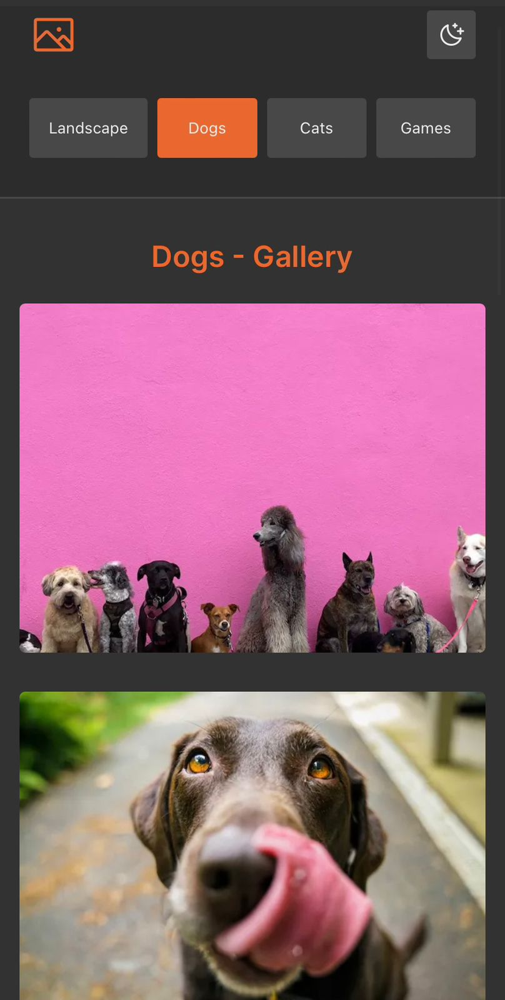

# Desafio PlaySmart Solution
---
### Apresentação das versões em Mobile e Desktop:

;

## Minimum requirements:

- [x] Use nextJS like framework
- [x] Use Typescript
- [x] Use React.createContext and React.useContext
- [x] Use API to fill the cards / tabs
- [x] Cards should be in 4 / 3 aspect ratio
- [x] Mobile and Desktop version
- [x] Use Sass modules to style it 
- [x] Create a git repository and invite me

## Will be nice if:

- [x] You make something creative, animation
- [x] No use of third libraries
- [x] Fell free to style colours, sizers
- [ ] Build a light and dark theme
- [ ] Multi language app
- [ ] Expand collapse the card view 

## Differentials:
- [x] Deploy on vercel: https://playsmart-solution-test.vercel.app/

## Tech:

- nextJS
- Typescript
- Git e GitHub
- Sass

## Difficulties:

1. The API photos were infinite 

## Solutions:

1. ` for (let i = 0; i < data.results.length; i++) {if (i === 9) {break}  const item = data.results[i]unsplashPictures.push({img: item.urls.regular, alt: item.alt_description,}) `

## Installation: 

1. Make sure you have nodejs and npm installed on your system
2. ` Git clone ` 
3. ` npm install `
4. ` npm run dev `

