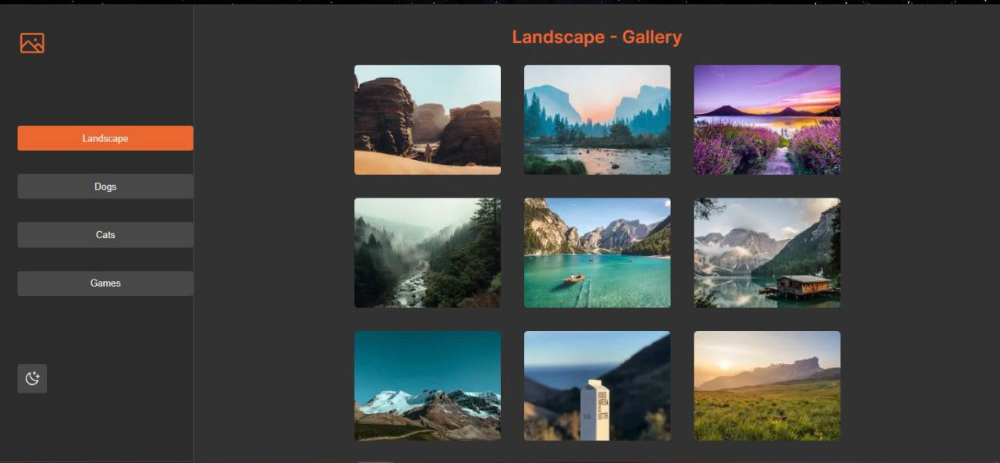

# PlaySmart Solution Challenge
---
### Presentation of mobile and desktop versions:

;

## Minimum requirements:

- [x] Use nextJS like framework
- [x] Use Typescript
- [x] Use React.createContext and React.useContext
- [x] Use API to fill the cards / tabs
- [x] Cards should be in 4 / 3 aspect ratio
- [x] Mobile and Desktop version
- [x] Use Sass modules to style it 
- [x] Create a git repository and invite me

## Will be nice if:

- [x] You make something creative, animation
- [x] No use of third libraries
- [x] Fell free to style colours, sizers

## Differentials:
- [x] Deploy on vercel: https://playsmart-solution-test.vercel.app/

## Tech:

- nextJS
- Typescript
- Git e GitHub
- Sass

## Difficulties:

1. The API photos were infinite 

## Solutions:

1. I implemented a counter controlled by a for loop that checks for the length of the array of images to be mapped and breaks the process when the array length reaches X

## Installation: 

1. Make sure you have nodejs and npm installed on your system
2. ` Git clone ` 
3. ` npm install `
4. ` npm run dev `